class: center, middle

# Déformation professionnelle

> Indique une attitude qui est apprise à l'occasion de l'exercice d'un métier et qui a été progressivement appliquée aussi au monde de la vie privée.

---
class: center, middle

.pull-left[

<p>&nbsp;</p>
<p>&nbsp;</p>
<p>&nbsp;</p>
<p>&nbsp;</p>
<p>&nbsp;</p>
<p>&nbsp;</p>

## Vie perso

]

.pull-right[ 

```{r echo=FALSE, out.width=450, fig.align='right'}
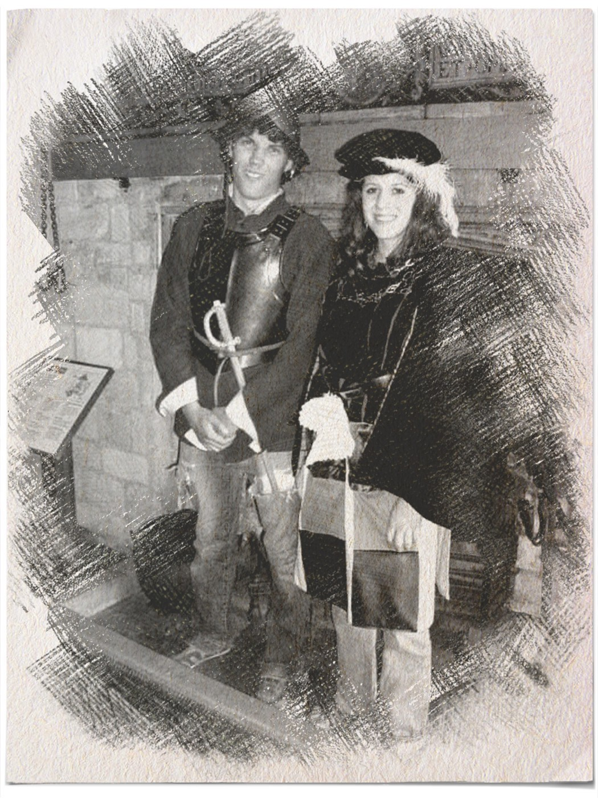
```

]

---
class: center, middle

.pull-left[

<p>&nbsp;</p>
<p>&nbsp;</p>
<p>&nbsp;</p>
<p>&nbsp;</p>
<p>&nbsp;</p>
<p>&nbsp;</p>

## Vie perso

]

.pull-right[ 

```{r echo=FALSE, out.width=450, fig.align='right'}
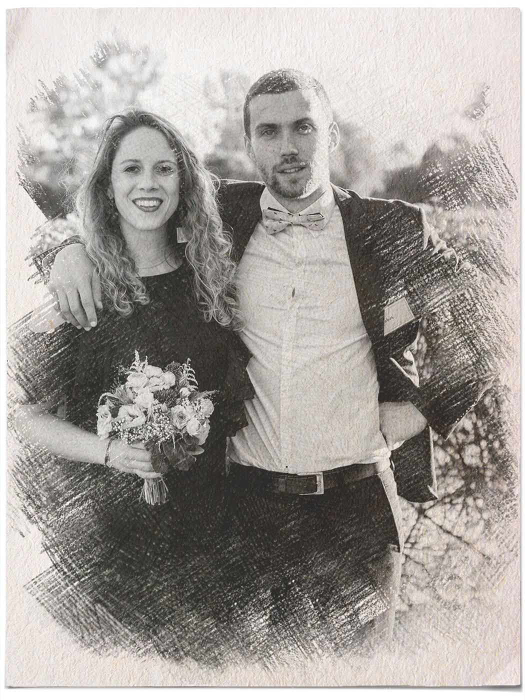
```

]

---
class: center, middle

.pull-left[

```{r echo=FALSE, out.width=450, fig.align='right'}
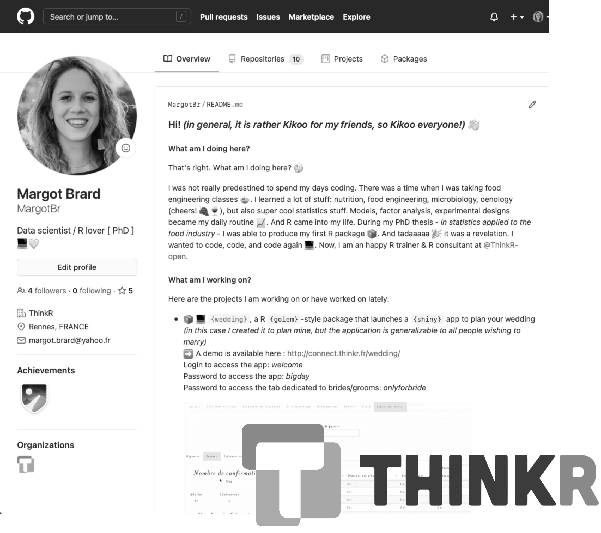
```

]

.pull-right[ 

<p>&nbsp;</p>
<p>&nbsp;</p>
<p>&nbsp;</p>
<p>&nbsp;</p>

## Vie pro

]

---
class: center, middle

# {wedding}

Une application Shiny pour gérer les préparatifs de notre mariage

```{r echo=FALSE, out.width=800, fig.align='center'}
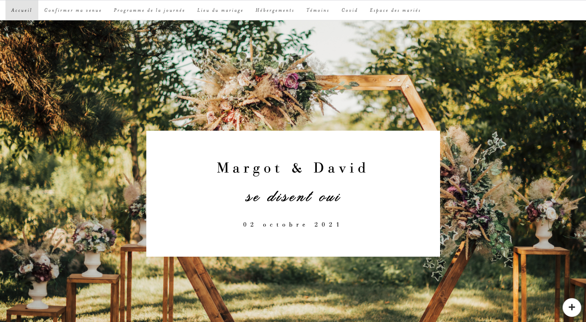
```

---

# Pourquoi une application Shiny ?

## Objectif

Avoir un outil **diffusé sur le web** avec une triple fonctionnalité :
- **Informer** les convives (aspects logistiques liés au déroulement du mariage) : textes, cartes
- **Échanger** avec les convives : saisie/enregistrement d'information
- **Piloter** les préparatifs du mariage (budget, plan de table, menus, etc.) : tables, graphiques

--

## Shiny

Permet de répondre au besoin en fournissant les outils nécessaires pour construire une **application web interactive** avec :

- Du texte
- Des cartes créées avec `{leaflet}`
- Des tables créées avec `{DT}`
- Des graphiques créées avec `{ggplot2}`

---

# Cahier des charges

## Cœur de l'application

- Des **onglets informatifs** destinés aux convives
- Un **onglet avec un formulaire** permettant aux convives d'indiquer leur présence/absence et leur choix de menu
- Un **onglet sécurisé** uniquement accessible par les mariés avec un système identifiant/mot de passe cachant un **dashboard** pour les préparatifs (budget, plan de table, menus, etc.)
- Un agencement basé sur des **modules** pour plus de fluidité dans le développement
- Un **graphisme** global de l'application en adéquation avec le faire-part (couleurs, polices de caractère)
- Un **graphisme** des graphiques, cartes, etc. en adéquation avec le faire-part
- **Documentation** du code

## Données

- Des données stockées sur **Google drive** pour permettre aux mariés d'y accéder depuis n'importe quel outil

---

# Cahier des charges

## Accès

- Un **accès sécurisé** avec un système identifiant/mot de passe

## Mise en production

- **Versionnement** du code
- **Intégration continue/Déploiement continu**

---

**TODO**

<iframe width="1000" height="500" src="https://www.youtube.com/embed/6A5EpqqDOdk" frameborder="0" allowfullscreen, style = "display: flex; align-items: center;justify-content: center;" ></iframe>

---

# Cœur de l'application

## Mise en package

```{r echo=FALSE, out.width=150, fig.align='center'}
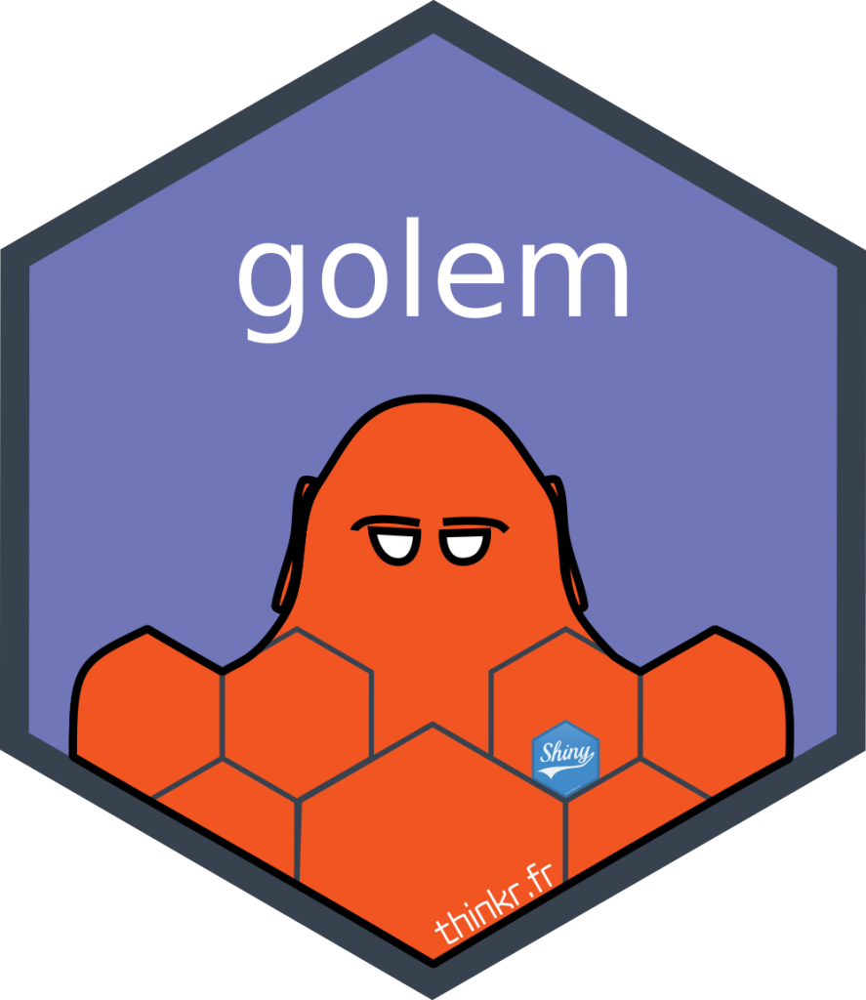
```

Permet de :
- **Documenter** le code
- Utiliser les infrastructures de **tests** natives
- Faciliter la **maintenance** sur le long terme
- **Gérer les fichiers** de manière efficace
- Bénéficier des outils "classiques" de **développement** (`{devtools}`, `{usethis}`, `{testthat}`, ...)
- Faciliter le **déploiement**

---

# Cœur de l'application

## Découpage de l'app en modules

Permet de ne pas avoir à gérer une app de plusieurs milliers de lignes

```{r echo=FALSE, out.width=300, fig.align='center'}
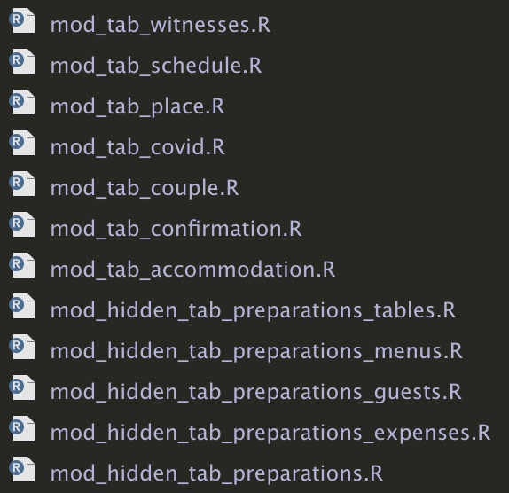
```

---

# Cœur de l'application

## Découpage de l'app en modules

.pull-left[

**Partie UI**

```{r eval=FALSE}
tabPanel(
  title = "Accueil",
  mod_tab_couple_ui("tab_couple")
  ),

tabPanel(
  title = "Confirmer ma venue", 
  mod_tab_confirmation_ui("tab_confirmation")
  ),
...
```

]

.pull-right[ 

**Partie serveur**

```{r eval=FALSE}
mod_tab_couple_server("tab_couple", r_global = r_global)
mod_tab_confirmation_server("tab_confirmation", r_global = r_global)
...
```

**Communication entre modules** réalisée au moyen de **reactive values** qui sont passées en paramètres des fonctions d'appel des modules dans la partie serveur de l'app

]

---

# Cœur de l'application

## Design

### Gestion de l'apparence globale de l'app et de la page de connexion

+ Création de 2 **fichiers .css** pour gérer la majorité du design
+ **Inline css** pour le spécifique

```{css eval=FALSE}
h1("Confirmer ma venue / notre venue", 
   style = "font-family: \'Bauer Bodoni Std 1\'; 
            font-size:30px; 
            letter-spacing:5px; 
            color: black; 
            text-align: center")
```

---

# Cœur de l'application

## Design

### Gestion des 3 polices de caractère

+ Pour utilisation **dans l'UI de l'app** : import des fichiers de fontes au format web dans les .css

```{css eval=FALSE}
@font-face {
    font-family: 'Old Script';
    src: url('fonts/OldScript.eot');
    ...
}
```

---

# Cœur de l'application

## Design

### Gestion des 3 polices de caractère

+ Pour utilisation **dans les graphiques `{ggplot2}`** : création d'une fonction basée sur le package `{extrafont}` et lancée au chargement du package qui :
    - installe les polices de caractère si elles n'existent pas
    - les enregistre dans R pour utilisation

```{r eval=FALSE}
extrafont::font_import(
      paths = system.file("font", package = "wedding"),
      )
extrafont::loadfonts(device = "postscript")
```

---

# Données

Gestion des données stockées sur google drive avec le package `{googledrive}`
  - **Connexion au compte** google drive
  - **Téléchargement** des données et stockage dans une **reactive value** pour utilisation dans l'app

```{r echo=FALSE, out.width=550, fig.align='center'}
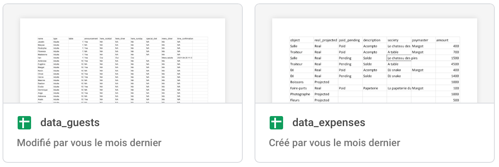
```

```{r eval=FALSE}
googledrive::drive_auth(cache = ".secrets", 
                        email = Sys.getenv("GOOGLE_MAIL"))
```

```{r eval=FALSE}
temp_dir <- tempdir()
googledrive::drive_download("data_expenses", path = glue::glue(temp_dir, "/data_expenses.csv"), overwrite = TRUE)
data_expenses <- read_csv(glue::glue(temp_dir, "/data_expenses.csv"), locale = locale(decimal_mark = ","))
r_global$data_expenses <- data_expenses
```

---

# Accès

## Accès à l'app

Mise en place d'une **authentification sécurisée** avec le package `{shinymanager}`

  - **Partie serveur** : définition et gestion des identifiants de connexion

```{r eval=FALSE}
credentials <- data.frame(
  user = Sys.getenv("LOGIN_USER"), 
  password = Sys.getenv("PWD_USER"),
  ...
)

shinymanager::secure_server(
  check_credentials = shinymanager::check_credentials(credentials)
)  
```

---

# Accès

## Accès à l'app

.pull-left[

  - **Partie UI** : définition de l'apparence de la page de connexion

```{r eval=FALSE}
ui <- shinymanager::secure_app(
  ui = app_ui,
  head_auth = golem_add_external_resources(), # custom css pour la page de logging + labels (cf dessous)
  background  = glue::glue("url(\'../www/", Sys.getenv("IMG_BACKGROUND"), "\') no-repeat center top fixed;")
)

golem_add_external_resources <- function(){
  
  shinymanager::set_labels(
    "Please authenticate" = "Site du mariage de Margot & David",
    "Username:" = "Identifiant (indiqu\u00e9 sur le faire-part) :",
    ...
    )
  
    tags$link(href = "www/custom_logging_style.css", rel = "stylesheet", type = "text/css")
    ...
}
```

]

.pull-right[ 

```{r echo=FALSE, out.width=250, fig.align='center'}
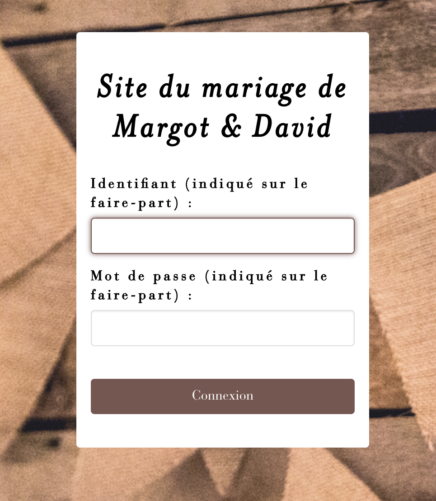
```

```{r echo=FALSE, out.width=50, fig.align='center'}
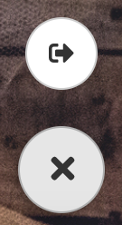
```

]

---

# Accès

## Accès à l'onglet caché dédié aux mariés

Fonctionnement via un système `renderUI()/uiOutput()` : l'onglet ne s'affiche qui si le mot de passe rentré correspond au mot de passe spécifié en variable d'environnement

.pull-left[

**Partie UI**

```{r eval=FALSE}
passwordInput(
  inputId = ns("password_tab_preparation"), 
  "Mot de passe :"
  ),

uiOutput(ns("show_tab_preparation"))
```

]

.pull-right[ 

**Partie serveur**

```{r eval=FALSE}
observeEvent(input$password_tab_preparation, {
  
  if (input$password_tab_preparation == Sys.getenv("PWD_COUPLE")) {
    output$show_tab_preparation <- renderUI({...})
  }
  
})
```

]

---

# Mise en production

.pull-left[

```{r echo=FALSE, out.width=420, fig.align='right'}
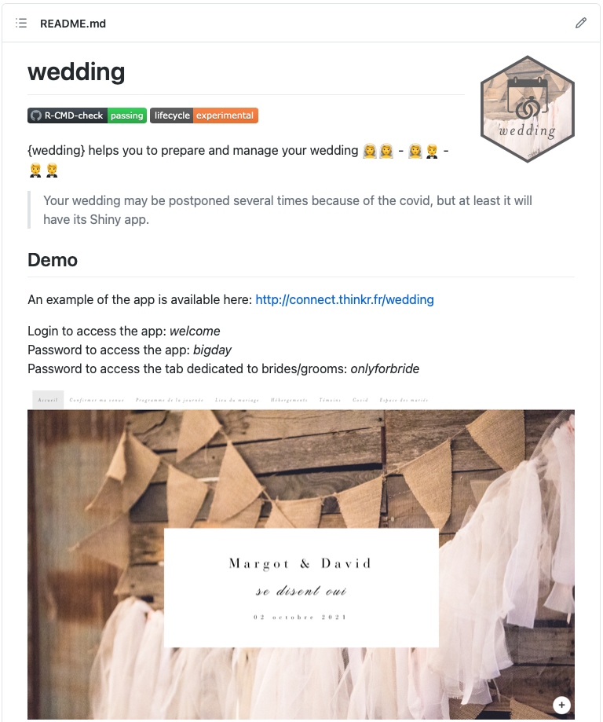
```

]

.pull-right[ 

- **Versionnement du code** : repo sur GitHub 

<center>https://github.com/ThinkR-open/wedding</center>

- **Intégration Continue** : workflow GitHub Actions R CMD check pour vérifier automatiquement le code sur les trois principaux systèmes d'exploitation

```{r echo=FALSE, out.width=500, fig.align='right'}
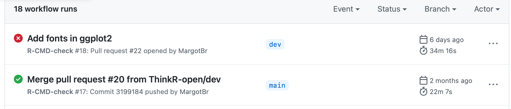
```

]

---

# Mise en production

- **Déploiement sur R Studio Connect** : 
  + Déploiement en parallèle de la version de notre mariage et de la version de démo à partir du même code en jouant sur des **variables d'environnement**
  + Déploiement **manuel en local** avec le package `{rsconnect}`

```{r eval=FALSE}
Sys.setenv(GOOGLE_MAIL = "wedding.r.package@gmail.com")
Sys.setenv(LOGIN_USER = "welcome")
Sys.setenv(PWD_USER = "bigday")
Sys.setenv(IMG_BACKGROUND = "wedding-background-demo-compressed.jpg")
...
```

```{r eval=FALSE}
rsconnect::connectApiUser(
  account = Sys.getenv("NAME_ACCOUNT_RSTUDIO_CONNECT"),
  server = Sys.getenv("NAME_SERVER_RSTUDIO_CONNECT"),
  apiKey = Sys.getenv("API_CONNECT_KEY")
)

rsconnect::deployApp(
  appName = Sys.getenv("APP_NAME"),
  appTitle = Sys.getenv("APP_TITLE"),
  account = Sys.getenv("NAME_ACCOUNT_RSTUDIO_CONNECT"),                   
  server = Sys.getenv("NAME_SERVER_RSTUDIO_CONNECT")        
)
```

---

# TO DO list

- Déploiement Continu sur GitHub Actions
- Gérer l'auth google drive avec un URL de callback
- Retravail de l'UI pour être responsive sur mobile

```{r echo=FALSE, out.width=300, fig.align='center'}
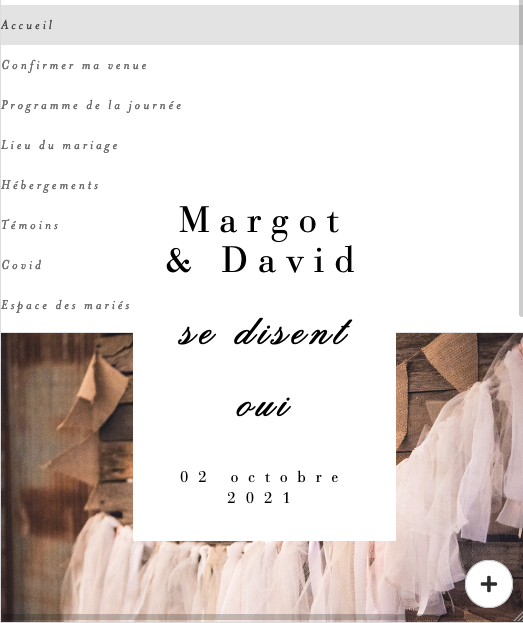
```

---

```{r echo=FALSE, out.width=700, fig.align='right'}
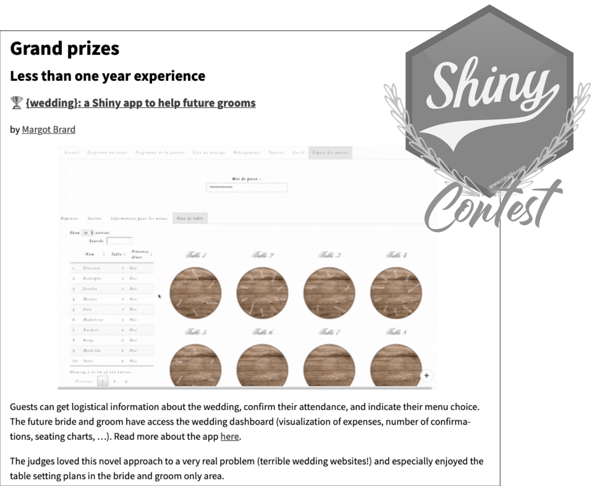
```

---
class: center, middle

# Merci

### `r emo::ji("bride")` margot@thinkr.fr

### https://github.com/MargotBr

### https://github.com/ThinkR-open
